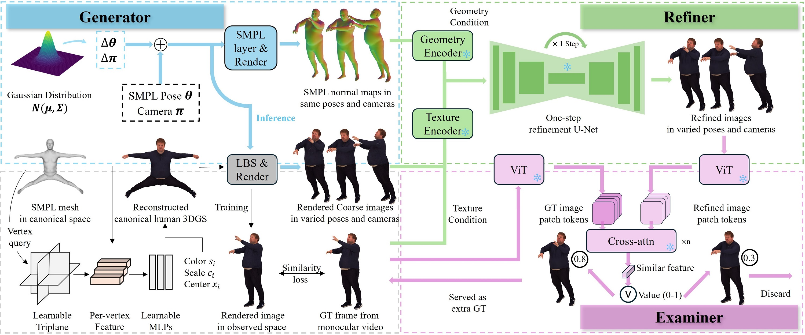

# ACMMM20264623
# Generator–Refiner–Examiner: A Tri-Module Data Augmentation Framework for 3D Human Avatar Learning from Monocular Videos

---

# Abstract

This paper addresses the challenge of reconstructing photorealistic and animatable 3D human avatars from monocular videos. While existing methods rely on combining per-subject optimization with generic human priors, they often fail to capture fine-grained details when training frames are limited. To mitigate this data scarcity, we propose TrioMan, a systematic tri-module framework for augmented 3D avatar learning. Our approach comprises three synergistic components. The Generator creates diverse unseen samples by imposing Gaussian perturbations on pose and camera. The Refiner improves the quality of generated data through one-step diffusion guided by texture and geometry cues. The Examiner selects subject-consistent samples using a dual-branch attention-based similarity evaluation. Experiments on the X-Humans and NeuMan benchmarks show that TrioMan outperforms state-of-the-art methods.

---

# Intuitive Comparison 
These videos show the performance gap between our method and the baseline. Our model yields visibly superior results, characterized by reductions in artifacts and enhanced details.

  <video width="600px" controls autoplay loop muted playsinline>
    <source src="meta/1-1.mp4" type="video/mp4">
    Your browser does not support the video tag.
  </video>

---

# Method Overview

Our method, TrioMan, addresses expressive 3D human avatar learning from monocular video by introducing a tri-module (Generator-Refiner-Examiner) augmented avatar learning framework. The Generator leverages Gaussian distributions to sample pose and camera perturbations, which are fused with the SMPL pose (fitted from the video frame) and camera pose to generate SMPL pose variations that can drive the Human 3D Gaussian reconstructed from the baseline model to produce unseen coarse frames. The Refiner takes geometric conditions from variation SMPLs and texture conditions from the real frame, refining them via a one-step diffusion process to generate photorealistic refined frames. Moreover, the Examiner assesses the similarity in details between the refined frame and the real video frame to determine whether the refined frame will be included as a pseudo ground truth (GT) for the avatar learning.
